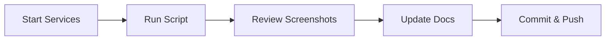

# 📸 Quick Screenshot Reference Card

One-page reference for capturing AutoPilot screenshots.

## 🚀 Quick Commands

```bash
# 1. Start services (2 terminals)
cd backend && python run.py
cd frontend && npm run dev

# 2. Capture screenshots
npm run capture:screenshots

# 3. Review screenshots
explorer docs\assets\screenshots  # Windows
open docs/assets/screenshots      # macOS
```

## 📋 Pre-Flight Checklist

- [ ] Backend running on `http://localhost:8000`
- [ ] Frontend running on `http://localhost:5173`
- [ ] Auth token exists (`tests/config/.auth-token`)
- [ ] (Optional) Test data created for better screenshots

## 📁 Output Location

```
docs/assets/screenshots/
├── autopilot-dashboard.png
├── autopilot-strategy-builder-new.png
├── autopilot-strategy-detail.png
├── autopilot-settings.png
├── autopilot-template-library.png
├── autopilot-trade-journal.png
├── autopilot-analytics.png
├── autopilot-reports.png
├── autopilot-backtests.png
└── autopilot-shared-strategies.png
```

## 🔧 Quick Fixes

| Issue | Quick Fix |
|-------|-----------|
| No auth token | `npm run test:oauth:auto` |
| Backend down | `cd backend && python run.py` |
| Frontend down | `cd frontend && npm run dev` |
| Empty screenshots | Create test data via UI first |
| Browser stuck | Close manually |

## 📚 Full Docs

- **Complete Guide:** `docs/autopilot/SCREENSHOTS-GUIDE.md`
- **Technical Docs:** `tests/e2e/utils/README.md`
- **Setup Summary:** `SCREENSHOT-CAPTURE-SETUP.md`

## 🎯 Workflow



---

**Command:** `npm run capture:screenshots`
**Time:** ~2-3 minutes
**Output:** 10-16 screenshots
