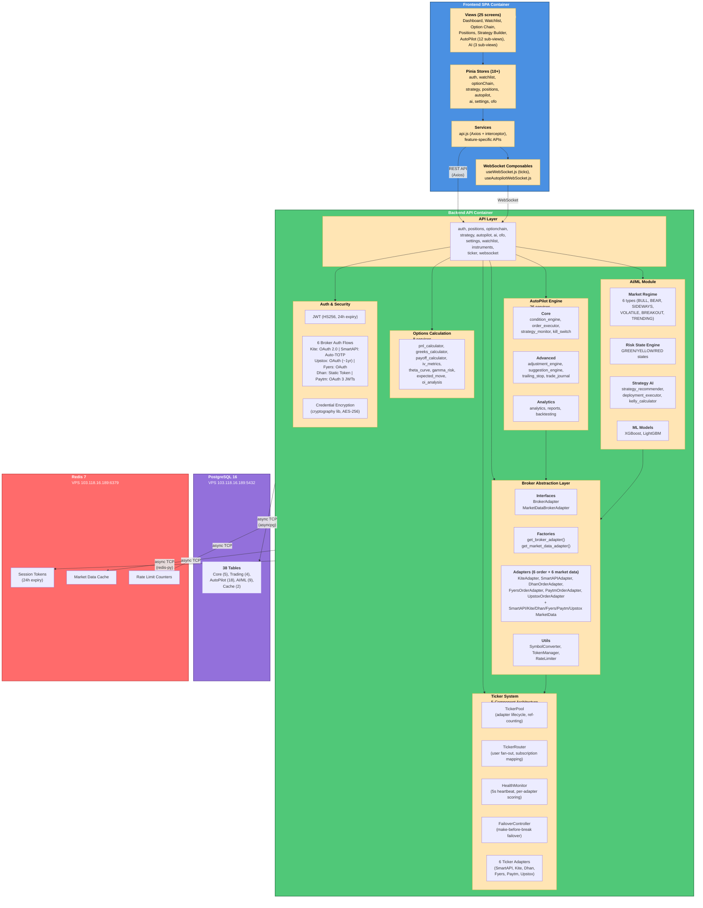

# Container and Component Diagram

**Last Updated:** 2026-03-02

This diagram shows AlgoChanakya's internal architecture, including containers (deployable units) and their internal components.

---

## Mermaid Diagram



---

## ASCII Art Version

```
┌─────────────────────────────────────────────────────────────────────────┐
│                     FRONTEND SPA CONTAINER                              │
│                   Vue 3 + Vite + Pinia + Tailwind CSS 4                 │
│                     Port: 5173 (dev) / 3004 (prod)                      │
├─────────────────────────────────────────────────────────────────────────┤
│                                                                         │
│  ┌─────────────────────────────────────────────────────────────────┐   │
│  │ Views (25 screens)                                              │   │
│  │ - Dashboard, Watchlist, Option Chain, Positions                 │   │
│  │ - Strategy Builder, Strategy Library, OFO, Settings             │   │
│  │ - AutoPilot (12 sub-views), AI (3 sub-views)                    │   │
│  └───────────────────────┬─────────────────────────────────────────┘   │
│                          ▼                                              │
│  ┌─────────────────────────────────────────────────────────────────┐   │
│  │ Pinia Stores (10+)                                              │   │
│  │ auth, watchlist, optionChain, strategy, positions, autopilot,   │   │
│  │ ai, settings, ofo                                               │   │
│  └───────────────────────┬─────────────────────────────────────────┘   │
│                          ▼                                              │
│  ┌─────────────────────────────────────────────────────────────────┐   │
│  │ Services                                                        │   │
│  │ - api.js (Axios + interceptor)                                  │   │
│  │ - Feature-specific APIs                                         │   │
│  └───────────────────────┬─────────────────────────────────────────┘   │
│                          │                                              │
│  ┌─────────────────────────────────────────────────────────────────┐   │
│  │ WebSocket Composables                                           │   │
│  │ - useWebSocket.js (ticks)                                       │   │
│  │ - useAutopilotWebSocket.js                                      │   │
│  └─────────────────────────┬───────────────────────────────────────┘   │
│                            │                                            │
└────────────────────────────┼────────────────────────────────────────────┘
                             │
                             ▼ REST API (Axios) + WebSocket
┌─────────────────────────────────────────────────────────────────────────┐
│                      BACKEND API CONTAINER                              │
│                FastAPI + async SQLAlchemy + Uvicorn                     │
│                     Port: 8001 (dev) / 8000 (prod)                      │
├─────────────────────────────────────────────────────────────────────────┤
│                                                                         │
│  ┌─────────────────────────────────────────────────────────────────┐   │
│  │ API Layer (18 route modules)                                    │   │
│  │ /api/auth, /api/positions, /api/optionchain, /api/strategy,     │   │
│  │ /api/v1/autopilot, /api/v1/ai, /api/ofo, /api/settings,         │   │
│  │ /ws/ticks, /ws/autopilot                                        │   │
│  └───────────────────────┬─────────────────────────────────────────┘   │
│                          ▼                                              │
│  ┌─────────────────────────────────────────────────────────────────┐   │
│  │ Broker Abstraction Layer                                        │   │
│  │ ┌─────────────────┬──────────────────┬────────────────────────┐ │   │
│  │ │ Interfaces      │ Factories        │ Order Adapters (6)     │ │   │
│  │ │ - BrokerAdapter │ - get_broker_    │ - KiteAdapter          │ │   │
│  │ │ - MarketData    │   adapter()      │ - SmartAPIAdapter      │ │   │
│  │ │   BrokerAdapter │ - get_market_    │ - DhanOrderAdapter     │ │   │
│  │ │                 │   data_adapter() │ - FyersOrderAdapter    │ │   │
│  │ │                 │                  │ - PaytmOrderAdapter    │ │   │
│  │ │                 │                  │ - UpstoxOrderAdapter   │ │   │
│  │ │                 │                  ├────────────────────────┤ │   │
│  │ │                 │                  │ MarketData Adap. (6)   │ │   │
│  │ │                 │                  │ - SmartAPIMarketData   │ │   │
│  │ │                 │                  │ - KiteMarketData       │ │   │
│  │ │                 │                  │ - DhanMarketData       │ │   │
│  │ │                 │                  │ - FyersMarketData      │ │   │
│  │ │                 │                  │ - PaytmMarketData      │ │   │
│  │ │                 │                  │ - UpstoxMarketData     │ │   │
│  │ └─────────────────┴──────────────────┴────────────────────────┘ │   │
│  │ Utils: SymbolConverter, TokenManager, RateLimiter              │   │
│  └─────────────────────────────────────────────────────────────────┘   │
│                                                                         │
│  ┌─────────────────────────────────────────────────────────────────┐   │
│  │ Ticker System (5-Component Architecture)                        │   │
│  │ - TickerPool (adapter lifecycle, ref-counted subscriptions)     │   │
│  │ - TickerRouter (user fan-out, subscription mapping)             │   │
│  │ - HealthMonitor (5s heartbeat, per-adapter scoring)             │   │
│  │ - FailoverController (make-before-break failover)               │   │
│  │ - 6 Adapters: SmartAPI, Kite, Dhan, Fyers, Paytm, Upstox      │   │
│  └─────────────────────────────────────────────────────────────────┘   │
│                                                                         │
│  ┌─────────────────────────────────────────────────────────────────┐   │
│  │ AutoPilot Engine (26 services)                                  │   │
│  │ - Core: condition_engine, order_executor, strategy_monitor,     │   │
│  │   kill_switch                                                   │   │
│  │ - Advanced: adjustment_engine, suggestion_engine, trailing_stop,│   │
│  │   trade_journal                                                 │   │
│  │ - Analytics: analytics, reports, backtesting                    │   │
│  └─────────────────────────────────────────────────────────────────┘   │
│                                                                         │
│  ┌─────────────────────────────────────────────────────────────────┐   │
│  │ AI/ML Module                                                    │   │
│  │ - Market Regime (6 types: BULL, BEAR, SIDEWAYS, VOLATILE,       │   │
│  │   BREAKOUT, TRENDING)                                           │   │
│  │ - Risk State Engine (GREEN/YELLOW/RED states)                   │   │
│  │ - Strategy AI (strategy_recommender, deployment_executor,       │   │
│  │   kelly_calculator)                                             │   │
│  │ - ML Models (XGBoost, LightGBM)                                 │   │
│  └─────────────────────────────────────────────────────────────────┘   │
│                                                                         │
│  ┌─────────────────────────────────────────────────────────────────┐   │
│  │ Options Calculation (8 services)                                │   │
│  │ pnl_calculator, greeks_calculator, payoff_calculator, iv_metrics,│   │
│  │ theta_curve, gamma_risk, expected_move, oi_analysis             │   │
│  └─────────────────────────────────────────────────────────────────┘   │
│                                                                         │
│  ┌─────────────────────────────────────────────────────────────────┐   │
│  │ Auth & Security                                                 │   │
│  │ - JWT (HS256, 24h expiry) — user session tokens                 │   │
│  │ - 6 Broker Auth Flows:                                          │   │
│  │   Kite: OAuth 2.0 | SmartAPI: Auto-TOTP (pyotp)                │   │
│  │   Upstox: OAuth (~1yr) | Fyers: OAuth (midnight expiry)        │   │
│  │   Dhan: Static Token | Paytm: OAuth 3 JWTs                     │   │
│  │ - Credential Encryption (cryptography lib, AES-256)             │   │
│  └─────────────────────────────────────────────────────────────────┘   │
│                                                                         │
└────────────┬────────────────────────────┬───────────────────────────────┘
             │                            │
             │ async TCP (asyncpg)        │ async TCP (redis-py)
             ▼                            ▼
┌──────────────────────────┐    ┌────────────────────────────┐
│  PostgreSQL 16           │    │  Redis 7                   │
│  VPS 103.118.16.189:5432 │    │  VPS 103.118.16.189:6379   │
├──────────────────────────┤    ├────────────────────────────┤
│  38 Tables:              │    │  - Session Tokens (24h)    │
│  - Core (5)              │    │  - Market Data Cache       │
│  - Trading (4)           │    │  - Rate Limit Counters     │
│  - AutoPilot (18)        │    │                            │
│  - AI/ML (9)             │    │                            │
│  - Cache (2)             │    │                            │
└──────────────────────────┘    └────────────────────────────┘
```

---

## Container Details

### 1. Frontend SPA Container

**Technology Stack:**
- **Framework:** Vue 3 (Composition API)
- **Build Tool:** Vite 5
- **State Management:** Pinia
- **Styling:** Tailwind CSS 4
- **HTTP Client:** Axios
- **Charting:** Chart.js
- **WebSocket:** Native WebSocket API (composables)

**Ports:**
- Dev: 5173 (Vite default)
- Production: 3004 (static build served via PM2)

**Components:**

| Component | Purpose | Technology |
|-----------|---------|------------|
| **Views (25)** | Screen components | Vue 3 SFC (Single File Components) |
| **Pinia Stores (10+)** | State management | Pinia (Vue official state lib) |
| **Services** | API communication | Axios with interceptors |
| **Composables** | WebSocket logic | Vue Composition API |

**Key Views:**
- Dashboard (portfolio summary)
- Watchlist (instrument monitoring)
- Option Chain (Greeks, IV, OI analysis)
- Positions (live P&L tracking)
- Strategy Builder (multi-leg builder)
- AutoPilot (12 sub-views: strategies, orders, logs, analytics, templates, etc.)
- AI (3 sub-views: regime, risk, strategy)
- OFO (Optimal F&O calculator)
- Settings (broker connections, preferences)

---

### 2. Backend API Container

**Technology Stack:**
- **Framework:** FastAPI 0.110+
- **ORM:** async SQLAlchemy 2.0
- **Server:** Uvicorn (ASGI)
- **Database Driver:** asyncpg (PostgreSQL)
- **Cache Driver:** redis-py (async)
- **Authentication:** python-jose (JWT)
- **Broker SDKs:** kiteconnect, smartapi-python, httpx (Upstox/Dhan/Fyers/Paytm REST)
- **AI/ML:** pandas, XGBoost, LightGBM
- **TOTP:** pyotp

**Ports:**
- Dev: 8001 (configurable in `backend/.env`)
- Production: 8000 (PM2-managed)

**Architecture Layers:**

#### API Layer (18 route modules)

| Route | Purpose |
|-------|---------|
| `/api/auth` | JWT login, logout, broker OAuth |
| `/api/positions` | Live positions, P&L tracking |
| `/api/optionchain` | Option chain data, Greeks, IV |
| `/api/strategy` | Manual strategy CRUD |
| `/api/v1/autopilot/*` | AutoPilot (10+ endpoints) |
| `/api/v1/ai/*` | AI regime, risk, strategy |
| `/api/ofo` | Optimal F&O calculator |
| `/api/settings` | User preferences, broker connections |
| `/api/watchlist` | Instrument watchlist CRUD |
| `/api/instruments` | Search instruments, get tokens |
| `/api/ticker` | Start/stop ticker subscriptions |
| `/ws/ticks` | WebSocket market data feed |
| `/ws/autopilot` | WebSocket AutoPilot updates |

#### Broker Abstraction Layer

**Interfaces:**
```python
# backend/app/services/brokers/base.py
class BrokerAdapter(ABC):
    """Order execution and position management"""
    @abstractmethod
    async def place_order(...) -> Dict
    @abstractmethod
    async def get_positions(...) -> List[Dict]
    @abstractmethod
    async def cancel_order(...) -> Dict

class MarketDataBrokerAdapter(ABC):
    """Market data and historical OHLC"""
    @abstractmethod
    async def get_quote(...) -> Dict
    @abstractmethod
    async def get_historical_data(...) -> pd.DataFrame
    @abstractmethod
    async def search_instruments(...) -> List[Dict]
```

**Factories:**
- `get_broker_adapter(broker_type, credentials)` → `KiteAdapter` | `SmartAPIAdapter` | `DhanOrderAdapter` | `FyersOrderAdapter` | `PaytmOrderAdapter` | `UpstoxOrderAdapter`
- `get_market_data_adapter(broker_type, credentials)` → `SmartAPIMarketDataAdapter` | `KiteMarketDataAdapter` | `DhanMarketDataAdapter` | `FyersMarketDataAdapter` | `PaytmMarketDataAdapter` | `UpstoxMarketDataAdapter`

**Utilities:**
- `SymbolConverter`: Convert between broker symbol formats (SmartAPI + Kite complete, 4 broker stubs)
- `TokenManager`: Resolve instrument tokens across brokers
- `RateLimiter`: Per-broker API rate limiting (SmartAPI 1/s, Kite 3/s, Dhan 10/s, Fyers 10/s general + 1/s historical, Paytm 10/s, Upstox 25/s)

#### Ticker System (5-Component Architecture, Complete)

| Component | File | Purpose |
|-----------|------|---------|
| **TickerPool** | `ticker/pool.py` | Adapter lifecycle, ref-counted subscriptions, credential integration |
| **TickerRouter** | `ticker/router.py` | User fan-out, maps subscriptions to correct broker adapter |
| **HealthMonitor** | `ticker/health.py` | 5s heartbeat, per-adapter scoring, triggers failover |
| **FailoverController** | `ticker/failover.py` | Make-before-break failover with configurable priority chain |
| **API Routes** | `api/routes/ticker.py` | `/api/ticker/health`, `/api/ticker/failover/status` |

**6 Ticker Adapters (all complete):**

| Adapter | File | Protocol | Capacity |
|---------|------|----------|----------|
| SmartAPI | `ticker/adapters/smartapi.py` | Binary (paise) | 3×3,000 = 9,000 tokens |
| Kite | `ticker/adapters/kite.py` | Binary (paise) | 3×3,000 = 9,000 tokens |
| Dhan | `ticker/adapters/dhan.py` | Little-endian binary | 5×100 = 500 tokens |
| Fyers | `ticker/adapters/fyers.py` | JSON | 5,000 tokens/connection |
| Paytm | `ticker/adapters/paytm.py` | JSON | 200 tokens/connection |
| Upstox | `ticker/adapters/upstox.py` | Protobuf | 1,500–5,000 tokens |

**Legacy tickers** (`SmartAPITickerService`, `KiteTickerService`) deprecated to `services/deprecated/`.
- See [TICKER-DESIGN-SPEC.md](../decisions/TICKER-DESIGN-SPEC.md)
- See [TICKER-IMPLEMENTATION-GUIDE.md](../guides/TICKER-IMPLEMENTATION-GUIDE.md)

#### AutoPilot Engine (26 services, 18 tables)

**Core Services:**
- `condition_engine.py` - Evaluate entry/exit/adjustment conditions
- `order_executor.py` - Execute orders via broker adapters
- `strategy_monitor.py` - Monitor active strategies
- `kill_switch.py` - Emergency shutdown

**Advanced Services:**
- `adjustment_engine.py` - Auto-adjust strategies
- `suggestion_engine.py` - AI-powered suggestions
- `trailing_stop.py` - Trailing stop-loss management
- `trade_journal.py` - Trade history and notes

**Analytics Services:**
- `analytics.py` - Performance metrics
- `reports.py` - PDF/Excel report generation
- `backtesting.py` - Historical simulation

**Full list:** See [backend/CLAUDE.md](../../backend/CLAUDE.md#autopilot-services-26-files)

#### AI/ML Module (9 tables)

**Market Regime Detection:**
- 6 regime types: BULL, BEAR, SIDEWAYS, VOLATILE, BREAKOUT, TRENDING
- Uses price action, volatility, and volume analysis
- Updates every 5 minutes

**Risk State Engine:**
- 3 states: GREEN (safe), YELLOW (cautious), RED (dangerous)
- Factors: VIX, drawdown, win rate, recent losses
- Blocks AutoPilot deployment in RED state

**Strategy AI:**
- `strategy_recommender.py` - Suggest strategies based on regime
- `deployment_executor.py` - Auto-deploy strategies
- `kelly_calculator.py` - Position sizing (Kelly Criterion)

**ML Models:**
- XGBoost: Regime classification
- LightGBM: Risk scoring

#### Options Calculation (8 services)

| Service | Purpose |
|---------|---------|
| `pnl_calculator.py` | Live P&L tracking |
| `greeks_calculator.py` | Delta, Gamma, Theta, Vega |
| `payoff_calculator.py` | Strategy payoff curves |
| `iv_metrics.py` | Implied volatility analysis |
| `theta_curve.py` | Time decay visualization |
| `gamma_risk.py` | Gamma exposure risk |
| `expected_move.py` | Expected price move calculator |
| `oi_analysis.py` | Open interest analysis |

#### Auth & Security

| Component | Technology | Purpose |
|-----------|------------|---------|
| **JWT** | python-jose, HS256 | User session tokens (24h expiry) |
| **Kite OAuth** | OAuth 2.0 redirect | Zerodha broker authentication |
| **SmartAPI Auto-TOTP** | pyotp | AngelOne automatic 2FA |
| **Upstox OAuth** | OAuth 2.0 (~1yr token) | Upstox broker authentication |
| **Fyers OAuth** | OAuth 2.0 (midnight expiry) | Fyers broker authentication |
| **Dhan Static Token** | API token (never expires) | Dhan broker authentication |
| **Paytm OAuth** | OAuth 2.0 (3 JWTs) | Paytm Money broker authentication |
| **Encryption** | cryptography (AES-256) | Stored broker credentials |

---

### 3. PostgreSQL 16 Container

**Location:** VPS 103.118.16.189:5432

**38 Tables (grouped by domain):**

| Domain | Tables | Count |
|--------|--------|-------|
| **Core** | users, broker_connections, user_preferences, smartapi_credentials, instruments | 5 |
| **Trading** | strategies, strategy_legs, strategy_templates, broker_instrument_tokens | 4 |
| **AutoPilot** | autopilot_user_settings, autopilot_strategies, autopilot_orders, autopilot_order_batches, autopilot_logs, autopilot_templates, autopilot_template_ratings, autopilot_condition_eval, autopilot_daily_summary, autopilot_adjustment_logs, autopilot_pending_confirmations, autopilot_trade_journal, autopilot_analytics_cache, autopilot_reports, autopilot_backtests, autopilot_position_legs, autopilot_adjustment_suggestions, autopilot_option_chain_cache | 18 |
| **AI/ML** | ai_user_config, ai_model_registry, ai_learning_reports, ai_paper_trades, ai_risk_state, ai_strategy_cooldown, ai_regime_history, ai_regime_performance, ai_decisions_log | 9 |
| **Cache** | autopilot_option_chain_cache, ai_market_snapshots | 2 |

**Connection:**
- Driver: asyncpg (async native PostgreSQL driver)
- Pool: 10 min / 20 max connections (configurable)
- Protocol: async TCP

**Full schema:** See [erd-data-model.md](erd-data-model.md)

---

### 4. Redis 7 Container

**Location:** VPS 103.118.16.189:6379

**Usage:**

| Purpose | Key Pattern | TTL |
|---------|-------------|-----|
| **Session Tokens** | `session:{token}` | 24 hours |
| **Market Data Cache** | `quote:{symbol}`, `ohlc:{symbol}:{interval}` | 1-5 minutes |
| **Rate Limit Counters** | `ratelimit:{broker}:{endpoint}` | 1 minute |

**Connection:**
- Driver: redis-py (async)
- Protocol: async TCP

---

## Data Flow

### 1. REST API Request Flow

```
User Browser
    ↓ (HTTPS POST /api/positions)
Frontend (Axios)
    ↓ (JWT token in header)
Backend API Layer (/api/positions)
    ↓ (Depends(get_current_user))
Auth Middleware (verify JWT)
    ↓
Broker Abstraction Layer (get_broker_adapter)
    ↓
Broker Adapter (Kite/SmartAPI/Dhan/Fyers/Paytm/Upstox)
    ↓ (REST API call)
External Broker API
    ↓
Response flows back through layers
```

### 2. WebSocket Market Data Flow

```
External Broker WebSocket (SmartAPI/Kite/Dhan/Fyers/Paytm/Upstox)
    ↓ (binary/JSON/Protobuf ticks)
TickerAdapter (broker-specific parser → unified format)
    ↓
TickerPool (adapter lifecycle, ref-counting)
    ↓
TickerRouter (user fan-out, subscription mapping)
    ↓
FastAPI WebSocket Endpoint (/ws/ticks)
    ↓ (broadcast JSON)
Frontend Composable (useWebSocket)
    ↓ (update Pinia store)
Vue Component (reactive UI update)
```

### 3. AutoPilot Order Execution Flow

```
AutoPilot Strategy Monitor
    ↓ (check conditions)
Condition Engine (evaluate entry/exit)
    ↓ (condition met)
Order Executor
    ↓ (async)
Broker Abstraction Layer (get_broker_adapter)
    ↓
Broker Adapter (Kite/SmartAPI/Dhan/Fyers/Paytm/Upstox)
    ↓ (place_order API call)
External Broker API
    ↓ (order placed)
Trade Journal (log trade)
    ↓
WebSocket Broadcast (/ws/autopilot)
    ↓
Frontend (real-time order update)
```

### 4. AI Regime Detection Flow

```
Scheduler (every 5 minutes)
    ↓
Market Regime Service
    ↓ (fetch OHLC)
Market Data Adapter (get_historical_data)
    ↓
External Broker API
    ↓ (price data)
ML Model (XGBoost)
    ↓ (predict regime)
Database (ai_regime_history table)
    ↓
WebSocket Broadcast (optional)
    ↓
Frontend AI View (regime indicator)
```

---

## Technology Summary

| Container | Key Technologies |
|-----------|------------------|
| **Frontend** | Vue 3, Vite, Pinia, Tailwind CSS 4, Axios, Chart.js |
| **Backend** | FastAPI, async SQLAlchemy, Uvicorn, asyncpg, redis-py |
| **Database** | PostgreSQL 16 (38 tables, 19 custom enums) |
| **Cache** | Redis 7 (sessions, data cache, rate limits) |
| **Broker SDKs** | kiteconnect, smartapi-python, httpx (Upstox/Dhan/Fyers/Paytm REST) |
| **AI/ML** | pandas, XGBoost, LightGBM |
| **Auth** | python-jose (JWT), pyotp (TOTP) |
| **Testing** | Playwright (122 E2E specs), pytest (67 tests), Vitest |

---

## Deployment Architecture

**Development:**
- Frontend: `npm run dev` (Vite dev server, port 5173)
- Backend: `python run.py` (Uvicorn, port 8001)
- Database/Redis: VPS-hosted (shared with production, different DB names)

**Production:**
- Frontend: `pm2` serving static build (port 3004)
- Backend: `pm2` running Uvicorn (port 8000)
- Database/Redis: VPS 103.118.16.189 (isolated database names)
- Location: `C:\Apps\algochanakya` (⚠️ NEVER TOUCH from dev environment)

**CI/CD:**
- GitHub Actions (4 workflows)
- Auto-deploy on merge to `main`

---

## Related Documentation

- **[Context Diagram](context-diagram.md)** - External system dependencies
- **[ERD Data Model](erd-data-model.md)** - Database schema (38 tables)
- **[Broker Abstraction Architecture](broker-abstraction.md)** - Multi-broker implementation
- **[Ticker Architecture](../decisions/TICKER-DESIGN-SPEC.md)** - Multi-broker WebSocket design
- **[AutoPilot Documentation](../autopilot/)** - AutoPilot service details
- **[Backend CLAUDE.md](../../backend/CLAUDE.md)** - Backend development guide
- **[Frontend CLAUDE.md](../../frontend/CLAUDE.md)** - Frontend development guide
