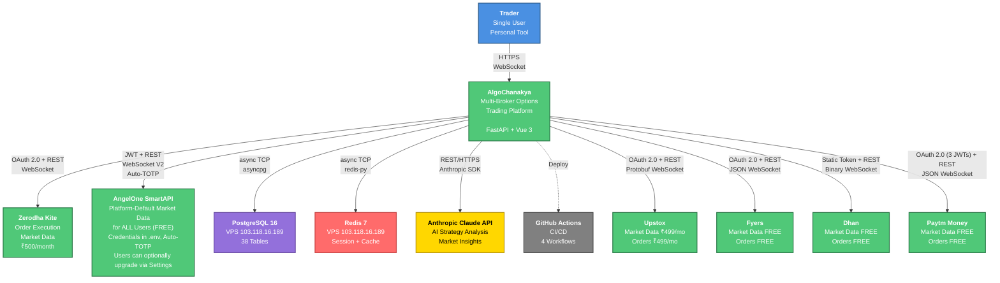

# System Context Diagram

**Last Updated:** 2026-03-02

This diagram shows AlgoChanakya's external system dependencies and user interactions.

---

## Mermaid Diagram



---

## ASCII Art Version

```
┌──────────┐
│  Trader  │ (Single User, Personal Tool)
└─────┬────┘
      │ HTTPS/WebSocket
      ▼
┌─────────────────────────────────────────────────────────┐
│                    AlgoChanakya                         │
│         Multi-Broker Options Trading Platform           │
│                  FastAPI + Vue 3                        │
└──┬──────┬──────┬──────┬──────┬──────┬───────────────────┘
   │      │      │      │      │      │
   │      │      │      │      │      └─────► GitHub Actions
   │      │      │      │      │              (CI/CD)
   │      │      │      │      │
   │      │      │      │      └────────────► Anthropic Claude API
   │      │      │      │                     (AI Analysis, REST/HTTPS)
   │      │      │      │
   │      │      │      └───────────────────► Redis 7
   │      │      │                            (VPS 103.118.16.189)
   │      │      │                            Session + Cache
   │      │      │                            async TCP
   │      │      │
   │      │      └──────────────────────────► PostgreSQL 16
   │      │                                   (VPS 103.118.16.189)
   │      │                                   38 Tables, async TCP
   │      │
   │      └─────────────────────────────────► AngelOne SmartAPI
   │                                          (FREE Market Data + Orders)
   │                                          JWT + REST + WebSocket V2
   │                                          Auto-TOTP
   │
   └────────────────────────────────────────► Zerodha Kite Connect
                                              (Orders + Market Data ₹500/mo)
                                              OAuth 2.0 + REST + WebSocket

   ├──────────────────────────────────────────────────► Upstox
   │                                                    (Orders + Market Data ₹499/mo)
   │                                                    OAuth 2.0 + REST + Protobuf WebSocket
   │
   ├──────────────────────────────────────────────────► Fyers
   │                                                    (FREE Market Data + Orders)
   │                                                    OAuth 2.0 + REST + JSON WebSocket
   │
   ├──────────────────────────────────────────────────► Dhan
   │                                                    (FREE Market Data + Orders)
   │                                                    Static Token + REST + Binary WebSocket
   │
   └──────────────────────────────────────────────────► Paytm Money
                                                        (FREE Market Data + Orders)
                                                        OAuth 2.0 (3 JWTs) + REST + JSON WebSocket
```

---

## Legend

| Visual Element | Meaning |
|---------------|---------|
| **Solid Lines** | Production integrations (active) |
| **Dashed Lines** | CI/CD and infrastructure connections |
| **Blue** | User/Actor |
| **Green** | Core system or production broker |
| **Purple** | Database |
| **Red** | Cache |
| **Yellow** | AI/ML service |
| **Gray** | CI/CD infrastructure |

---

## External Systems Summary

### Production Dependencies (10)

| System | Protocol | Purpose | Cost | Status |
|--------|----------|---------|------|--------|
| **Zerodha Kite Connect** | OAuth 2.0, REST, WebSocket | Order execution, market data | ₹500/month | ✅ Production |
| **AngelOne SmartAPI** | JWT, REST, WebSocket V2, Auto-TOTP | Market data (platform default), orders | FREE | ✅ Production |
| **Upstox** | OAuth 2.0, REST, Protobuf WebSocket | Market data, order execution | ₹499/month | ✅ Production |
| **Fyers** | OAuth 2.0, REST, JSON WebSocket | Market data, order execution | FREE | ✅ Production |
| **Dhan** | Static Token, REST, Binary WebSocket | Market data, order execution | FREE† | ✅ Production |
| **Paytm Money** | OAuth 2.0 (3 JWTs), REST, JSON WebSocket | Market data, order execution | FREE | ✅ Production |
| **PostgreSQL 16** | async TCP (asyncpg) | Primary database (38 tables) | Hosted on VPS | ✅ Production |
| **Redis 7** | async TCP (redis-py) | Session storage, caching | Hosted on VPS | ✅ Production |
| **Anthropic Claude API** | REST/HTTPS, Anthropic SDK | AI strategy analysis, market insights | API usage-based | ✅ Production |
| **GitHub Actions** | HTTPS (GitHub webhooks) | CI/CD (4 workflows: backend tests, E2E, deploy) | Free tier | ✅ Production |

**†** Dhan Data API is FREE with 25+ F&O trades/month, else ₹499/month

---

## Data Flow Protocols

### User → AlgoChanakya
- **REST API:** HTTPS (port 8001 dev / 8000 prod)
- **WebSocket:** `ws://localhost:8001/ws/ticks` (market data), `/ws/autopilot` (execution updates)

### AlgoChanakya → Zerodha Kite
- **Authentication:** OAuth 2.0 (3-legged flow)
- **REST API:** HTTPS (Kite Connect REST endpoints)
- **WebSocket:** KiteTicker WebSocket (binary protocol, ~60 ticks/sec)

### AlgoChanakya → AngelOne SmartAPI
- **Authentication:** JWT + Auto-TOTP (pyotp-based)
- **REST API:** HTTPS (SmartAPI REST endpoints)
- **WebSocket:** SmartAPI WebSocket V2 (JSON-based, subscription model)

### AlgoChanakya → Upstox
- **Authentication:** OAuth 2.0 (extended ~1 year token)
- **REST API:** HTTPS (Upstox v2 REST endpoints, 25 req/sec)
- **WebSocket:** Protobuf binary protocol (runtime descriptor, no compiled _pb2)

### AlgoChanakya → Fyers
- **Authentication:** OAuth 2.0 (unique `{app_id}:{access_token}` header, midnight IST expiry)
- **REST API:** HTTPS (Fyers REST endpoints, 10 req/sec general, 1 req/sec historical)
- **WebSocket:** JSON-based (FyersDataSocket, 5,000 symbols/connection)

### AlgoChanakya → Dhan
- **Authentication:** Static API token (never expires unless revoked)
- **REST API:** HTTPS (Dhan REST endpoints, 10 req/sec)
- **WebSocket:** Little-endian binary protocol (unique among brokers)

### AlgoChanakya → Paytm Money
- **Authentication:** OAuth 2.0 with 3 JWTs (`access_token`, `read_access_token`, `public_access_token`)
- **REST API:** HTTPS (custom `x-jwt-token` header, 10 req/sec)
- **WebSocket:** JSON-based (uses `public_access_token` as query param)

### AlgoChanakya → PostgreSQL
- **Connection:** async TCP via asyncpg
- **Pool:** 10 min, 20 max connections (configurable in `backend/.env`)

### AlgoChanakya → Redis
- **Connection:** async TCP via redis-py
- **Usage:** Session tokens, market data cache, rate limit counters

### AlgoChanakya → Anthropic Claude API
- **Protocol:** REST/HTTPS
- **SDK:** `anthropic` Python library
- **Models:** Claude 4.5 Sonnet (default), Haiku (fast tasks)

### AlgoChanakya ↔ GitHub Actions
- **Deploy:** GitHub webhooks trigger workflows on push/merge to `main`
- **Artifacts:** Allure test reports published to GitHub Pages

---

## Security Boundaries

1. **User Authentication:** JWT tokens (HS256, 24h expiry) — login credentials are NOT stored, only the resulting JWT
2. **Broker Credentials:** Encrypted at rest (AES-256 via `cryptography` lib) — applies to user-level market data API credentials stored in `smartapi_credentials` and `broker_connections` tables
3. **Platform Market Data Credentials:** Stored only in `backend/.env` — NOT in the database; serve all users by default (SmartAPI primary, failover chain for resilience)
4. **Database Access:** Whitelisted IPs only in `pg_hba.conf`
5. **Redis Sessions:** Expiring tokens (24h default)
6. **API Rate Limiting:** Per-broker adapters handle rate limits (e.g., SmartAPI 5 req/sec)

---

## Related Documentation

- **[Broker Abstraction Architecture](broker-abstraction.md)** - Multi-broker implementation details
- **[Container/Component Diagram](container-component-diagram.md)** - Internal architecture breakdown
- **[ERD Data Model](erd-data-model.md)** - Database schema (38 tables)
- **[ADR-002: Broker Abstraction](../decisions/002-broker-abstraction.md)** - Why and how we abstract brokers
- **[Ticker Architecture](../decisions/TICKER-DESIGN-SPEC.md)** - Multi-broker WebSocket architecture
