# System Context Diagram

**Last Updated:** 2026-02-16

This diagram shows AlgoChanakya's external system dependencies and user interactions.

---

## Mermaid Diagram

```mermaid
flowchart TB
    %% Styling
    classDef user fill:#4A90E2,stroke:#2E5C8A,stroke-width:2px,color:#fff
    classDef system fill:#50C878,stroke:#2D7A4A,stroke-width:2px,color:#fff
    classDef planned fill:#FFA500,stroke:#CC8400,stroke-width:2px,color:#fff,stroke-dasharray: 5 5
    classDef database fill:#9370DB,stroke:#6A4CA3,stroke-width:2px,color:#fff
    classDef cache fill:#FF6B6B,stroke:#C94545,stroke-width:2px,color:#fff
    classDef ai fill:#FFD700,stroke:#B8960A,stroke-width:2px,color:#000
    classDef cicd fill:#808080,stroke:#4D4D4D,stroke-width:2px,color:#fff

    %% Core System
    AlgoChanakya["<b>AlgoChanakya</b><br/>Multi-Broker Options<br/>Trading Platform<br/><br/>FastAPI + Vue 3"]

    %% Users
    Trader["<b>Trader</b><br/>Single User<br/>Personal Tool"]

    %% Production External Systems
    Zerodha["<b>Zerodha Kite</b><br/>Order Execution<br/>Market Data<br/>₹500/month"]
    SmartAPI["<b>AngelOne SmartAPI</b><br/>Market Data FREE<br/>Orders FREE<br/>Auto-TOTP"]
    PostgreSQL["<b>PostgreSQL 16</b><br/>VPS 103.118.16.189<br/>38 Tables"]
    Redis["<b>Redis 7</b><br/>VPS 103.118.16.189<br/>Session + Cache"]
    Claude["<b>Anthropic Claude API</b><br/>AI Strategy Analysis<br/>Market Insights"]
    GitHub["<b>GitHub Actions</b><br/>CI/CD<br/>4 Workflows"]

    %% Planned External Systems
    Upstox["<b>Upstox</b><br/>Market Data ₹499/mo<br/>Orders ₹499/mo<br/>Q2 2026"]
    Fyers["<b>Fyers</b><br/>Market Data FREE<br/>Orders FREE<br/>Q2 2026"]
    Dhan["<b>Dhan</b><br/>Market Data FREE<br/>Orders FREE<br/>Q3 2026"]
    Paytm["<b>Paytm Money</b><br/>Market Data FREE<br/>Orders FREE<br/>Q3 2026"]

    %% User Connections
    Trader -->|"HTTPS<br/>WebSocket"| AlgoChanakya

    %% Production Broker Connections
    AlgoChanakya -->|"OAuth 2.0 + REST<br/>WebSocket"| Zerodha
    AlgoChanakya -->|"JWT + REST<br/>WebSocket V2<br/>Auto-TOTP"| SmartAPI

    %% Database Connections
    AlgoChanakya -->|"async TCP<br/>asyncpg"| PostgreSQL
    AlgoChanakya -->|"async TCP<br/>redis-py"| Redis

    %% AI Integration
    AlgoChanakya -->|"REST/HTTPS<br/>Anthropic SDK"| Claude

    %% CI/CD
    AlgoChanakya -.->|"Deploy"| GitHub

    %% Planned Broker Connections
    AlgoChanakya -.->|"REST + WebSocket"| Upstox
    AlgoChanakya -.->|"REST + WebSocket"| Fyers
    AlgoChanakya -.->|"REST + WebSocket"| Dhan
    AlgoChanakya -.->|"REST + WebSocket"| Paytm

    %% Apply Styles
    class Trader user
    class AlgoChanakya system
    class Zerodha,SmartAPI system
    class PostgreSQL database
    class Redis cache
    class Claude ai
    class GitHub cicd
    class Upstox,Fyers,Dhan,Paytm planned
```



---

## ASCII Art Version

```
┌──────────┐
│  Trader  │ (Single User, Personal Tool)
└─────┬────┘
      │ HTTPS/WebSocket
      ▼
┌─────────────────────────────────────────────────────────┐
│                    AlgoChanakya                         │
│         Multi-Broker Options Trading Platform           │
│                  FastAPI + Vue 3                        │
└──┬──────┬──────┬──────┬──────┬──────┬───────────────────┘
   │      │      │      │      │      │
   │      │      │      │      │      └─────► GitHub Actions
   │      │      │      │      │              (CI/CD)
   │      │      │      │      │
   │      │      │      │      └────────────► Anthropic Claude API
   │      │      │      │                     (AI Analysis, REST/HTTPS)
   │      │      │      │
   │      │      │      └───────────────────► Redis 7
   │      │      │                            (VPS 103.118.16.189)
   │      │      │                            Session + Cache
   │      │      │                            async TCP
   │      │      │
   │      │      └──────────────────────────► PostgreSQL 16
   │      │                                   (VPS 103.118.16.189)
   │      │                                   38 Tables, async TCP
   │      │
   │      └─────────────────────────────────► AngelOne SmartAPI
   │                                          (FREE Market Data + Orders)
   │                                          JWT + REST + WebSocket V2
   │                                          Auto-TOTP
   │
   └────────────────────────────────────────► Zerodha Kite Connect
                                              (Orders + Market Data ₹500/mo)
                                              OAuth 2.0 + REST + WebSocket

   ┌─── PLANNED INTEGRATIONS (Dashed) ───────────────┐
   │                                                  │
   ├──────► Upstox (Q2 2026)  ──── ₹499/mo           │
   ├──────► Fyers (Q2 2026)   ──── FREE             │
   ├──────► Dhan (Q3 2026)    ──── FREE             │
   └──────► Paytm Money (Q3 2026) ─ FREE            │
                                                     │
   └──────────────────────────────────────────────────┘
```

---

## Legend

| Visual Element | Meaning |
|---------------|---------|
| **Solid Lines** | Production integrations (active) |
| **Dashed Lines** | Planned integrations (roadmap) |
| **Blue** | User/Actor |
| **Green** | Core system or production broker |
| **Orange** | Planned brokers |
| **Purple** | Database |
| **Red** | Cache |
| **Yellow** | AI/ML service |
| **Gray** | CI/CD infrastructure |

---

## External Systems Summary

### Production Dependencies (6)

| System | Protocol | Purpose | Cost | Status |
|--------|----------|---------|------|--------|
| **Zerodha Kite Connect** | OAuth 2.0, REST, WebSocket | Order execution, market data | ₹500/month | ✅ Production |
| **AngelOne SmartAPI** | JWT, REST, WebSocket V2, Auto-TOTP | Market data (default), orders | FREE | ✅ Production |
| **PostgreSQL 16** | async TCP (asyncpg) | Primary database (38 tables) | Hosted on VPS | ✅ Production |
| **Redis 7** | async TCP (redis-py) | Session storage, caching | Hosted on VPS | ✅ Production |
| **Anthropic Claude API** | REST/HTTPS, Anthropic SDK | AI strategy analysis, market insights | API usage-based | ✅ Production |
| **GitHub Actions** | HTTPS (GitHub webhooks) | CI/CD (4 workflows: backend tests, E2E, deploy) | Free tier | ✅ Production |

### Planned Brokers (4)

| Broker | Market Data | Orders | Target Quarter | Status |
|--------|-------------|--------|----------------|--------|
| **Upstox** | ₹499/mo | ₹499/mo | Q2 2026 | 📋 Planned |
| **Fyers** | FREE | FREE | Q2 2026 | 📋 Planned |
| **Dhan** | FREE | FREE | Q3 2026 | 📋 Planned |
| **Paytm Money** | FREE | FREE | Q3 2026 | 📋 Planned |

---

## Data Flow Protocols

### User → AlgoChanakya
- **REST API:** HTTPS (port 8001 dev / 8000 prod)
- **WebSocket:** `ws://localhost:8001/ws/ticks` (market data), `/ws/autopilot` (execution updates)

### AlgoChanakya → Zerodha Kite
- **Authentication:** OAuth 2.0 (3-legged flow)
- **REST API:** HTTPS (Kite Connect REST endpoints)
- **WebSocket:** KiteTicker WebSocket (binary protocol, ~60 ticks/sec)

### AlgoChanakya → AngelOne SmartAPI
- **Authentication:** JWT + Auto-TOTP (pyotp-based)
- **REST API:** HTTPS (SmartAPI REST endpoints)
- **WebSocket:** SmartAPI WebSocket V2 (JSON-based, subscription model)

### AlgoChanakya → PostgreSQL
- **Connection:** async TCP via asyncpg
- **Pool:** 10 min, 20 max connections (configurable in `backend/.env`)

### AlgoChanakya → Redis
- **Connection:** async TCP via redis-py
- **Usage:** Session tokens, market data cache, rate limit counters

### AlgoChanakya → Anthropic Claude API
- **Protocol:** REST/HTTPS
- **SDK:** `anthropic` Python library
- **Models:** Claude 4.5 Sonnet (default), Haiku (fast tasks)

### AlgoChanakya ↔ GitHub Actions
- **Deploy:** GitHub webhooks trigger workflows on push/merge to `main`
- **Artifacts:** Allure test reports published to GitHub Pages

---

## Security Boundaries

1. **User Authentication:** JWT tokens (HS256, 24h expiry)
2. **Broker Credentials:** Encrypted at rest (AES-256 via `cryptography` lib)
3. **Database Access:** Whitelisted IPs only in `pg_hba.conf`
4. **Redis Sessions:** Expiring tokens (24h default)
5. **API Rate Limiting:** Per-broker adapters handle rate limits (e.g., SmartAPI 5 req/sec)

---

## Related Documentation

- **[Broker Abstraction Architecture](broker-abstraction.md)** - Multi-broker implementation details
- **[Container/Component Diagram](container-component-diagram.md)** - Internal architecture breakdown
- **[ERD Data Model](erd-data-model.md)** - Database schema (38 tables)
- **[ADR-002: Broker Abstraction](../decisions/002-broker-abstraction.md)** - Why and how we abstract brokers
- **[Ticker Architecture](../decisions/TICKER-DESIGN-SPEC.md)** - Multi-broker WebSocket architecture
