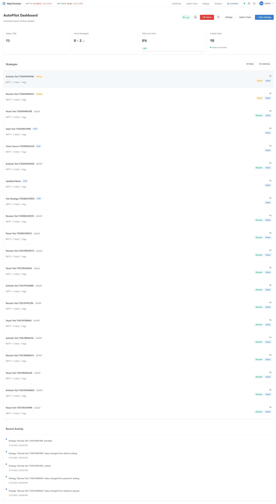
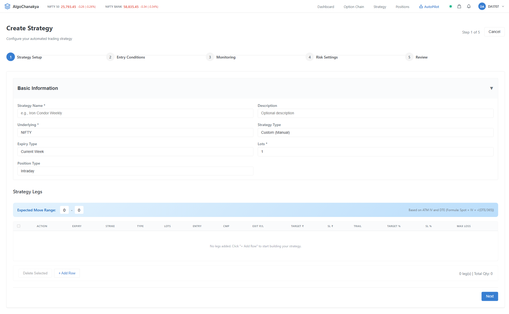

# AutoPilot Screenshots Guide

Quick reference for capturing and updating AutoPilot documentation screenshots.

## 📸 Capture New Screenshots

### Step 1: Prepare Environment

```bash
# Terminal 1 - Start Backend
cd backend
venv\Scripts\activate  # Windows
python run.py

# Terminal 2 - Start Frontend
cd frontend
npm run dev

# Terminal 3 - Check services
curl http://localhost:8000/api/health  # Should return {"status": "healthy"}
curl http://localhost:5173              # Should return HTML
```

### Step 2: Ensure Auth Token Exists

```bash
# Check if token file exists
cat tests/config/.auth-token  # Windows: type tests/config/.auth-token

# If missing, generate one
npm run test:oauth:auto  # Enter TOTP when prompted
```

### Step 3: (Optional) Create Test Data

For better screenshots with populated data:

1. Open browser: `http://localhost:5173`
2. Login with your credentials
3. Create 1-2 AutoPilot strategies
4. Generate some trade history (if possible)

### Step 4: Run Screenshot Capture

```bash
# From project root
npm run capture:screenshots
```

**Expected Output:**
```
🚀 Starting AutoPilot Screenshot Capture...
📁 Screenshots will be saved to: C:\...\docs\assets\screenshots

🔐 Authenticating...
   ✓ Authenticated

1️⃣  AutoPilot Dashboard
📸 Capturing: Dashboard with active strategies
   ✓ Saved: autopilot-dashboard.png

2️⃣  Strategy Builder (New Strategy)
📸 Capturing: Strategy Builder - Create New
   ✓ Saved: autopilot-strategy-builder-new.png

... (continues for all 12+ screens)

✅ Screenshot capture complete!
📊 Summary:
   - Total screenshots: 15
   - Location: C:\...\docs\assets\screenshots
```

### Step 5: Review Screenshots

```bash
# Open screenshots folder
explorer docs\assets\screenshots  # Windows
open docs/assets/screenshots      # macOS
xdg-open docs/assets/screenshots  # Linux
```

**Check for:**
- ✅ All screens captured (12+ files)
- ✅ Full page visible (no cut-off content)
- ✅ UI loaded completely (no spinners/loaders)
- ✅ Professional appearance (good test data, no errors)
- ✅ Consistent styling (same theme, viewport)

### Step 6: Update Documentation

Add screenshots to relevant docs:

**1. AutoPilot README** (`docs/autopilot/README.md`)
```markdown
## Screenshots

### Dashboard


### Strategy Builder

```

**2. UI/UX Design Doc** (`docs/autopilot/ui-ux-design.md`)
```markdown
## Screen: Dashboard


*Current implementation of the AutoPilot Dashboard showing...*
```

**3. Main Documentation** (`docs/README.md`)
```markdown
### AutoPilot Module

The AutoPilot module enables automated strategy execution.


```

### Step 7: Commit Changes

```bash
# Check what changed
git status

# Add screenshots
git add docs/assets/screenshots/autopilot-*.png

# Add updated docs (if any)
git add docs/autopilot/*.md
git add docs/README.md

# Commit
git commit -m "docs: Update AutoPilot screenshots for all screens

- Captured 12+ screenshots of AutoPilot UI
- Updated documentation with new screenshots
- Removed old outdated screenshots
"

# Push
git push origin main
```

## 🔧 Troubleshooting

### Issue: "No valid auth token available"

**Cause:** Missing or expired authentication token

**Solution:**
```bash
npm run test:oauth:auto
# Follow prompts and enter TOTP
# Token will be saved to tests/config/.auth-token
```

### Issue: Screenshots show empty states

**Cause:** No test data in the database

**Solution:** Manually create test data:
1. Login to the app
2. Create 1-2 AutoPilot strategies via UI
3. Re-run screenshot capture

### Issue: Browser doesn't close

**Cause:** Script runs in non-headless mode for debugging

**Solution:** Manually close browser, or edit script to use headless mode:
```javascript
// In screenshot-capture.js
const browser = await chromium.launch({
  headless: true, // Changed from false
  args: ['--start-maximized']
});
```

### Issue: Charts/animations incomplete

**Cause:** Page captured before dynamic content loaded

**Solution:** Increase wait time in script:
```javascript
// In screenshot-capture.js
const WAIT_FOR_LOAD = 3000; // Increased from 2000ms
```

### Issue: Service not running errors

**Check backend:**
```bash
curl http://localhost:8000/api/health
# Expected: {"status": "healthy"}
```

**Check frontend:**
```bash
curl http://localhost:5173
# Expected: HTML content
```

**Restart services if needed**

## 📋 Screenshot Checklist

Before committing, verify:

- [ ] All 12+ AutoPilot screens captured
- [ ] Screenshots show realistic test data (not all empty)
- [ ] No error messages or loading spinners visible
- [ ] Consistent viewport size (1920x1080)
- [ ] Professional appearance
- [ ] File names follow convention: `autopilot-{screen-name}.png`
- [ ] Files saved in `docs/assets/screenshots/`
- [ ] Documentation updated with new screenshots
- [ ] Old/outdated screenshots removed
- [ ] Changes committed to git

## 📂 Screenshot Inventory

| Screen | Filename | Status |
|--------|----------|--------|
| Dashboard | `autopilot-dashboard.png` | ✅ |
| Strategy Builder (New) | `autopilot-strategy-builder-new.png` | ✅ |
| Strategy Builder (Filled) | `autopilot-strategy-builder-filled.png` | ✅ |
| Strategy Builder (Edit) | `autopilot-strategy-builder-edit.png` | ⚠️ Optional |
| Strategy Detail | `autopilot-strategy-detail.png` | ⚠️ Optional |
| Settings | `autopilot-settings.png` | ✅ |
| Template Library | `autopilot-template-library.png` | ✅ |
| Template Details Modal | `autopilot-template-details-modal.png` | ⚠️ Optional |
| Trade Journal | `autopilot-trade-journal.png` | ✅ |
| Analytics | `autopilot-analytics.png` | ✅ |
| Reports | `autopilot-reports.png` | ✅ |
| Reports Modal | `autopilot-reports-generate-modal.png` | ⚠️ Optional |
| Backtests | `autopilot-backtests.png` | ✅ |
| Backtest Config Modal | `autopilot-backtest-config-modal.png` | ⚠️ Optional |
| Shared Strategies | `autopilot-shared-strategies.png` | ✅ |
| Kill Switch Modal | `autopilot-kill-switch-modal.png` | ⚠️ Optional |

✅ = Required
⚠️ = Optional (requires test data)

## 🚀 Quick Commands

```bash
# Full workflow (from project root)
npm run capture:screenshots     # Capture all screenshots
explorer docs\assets\screenshots # Review captures
git add docs/                   # Stage changes
git commit -m "docs: Update AutoPilot screenshots"
git push                        # Push to remote

# Alternative: Just capture and review
npm run capture:screenshots && explorer docs\assets\screenshots
```

## 📚 Related Documentation

- **Utility README:** `tests/e2e/utils/README.md`
- **Capture Script:** `tests/e2e/utils/screenshot-capture.js`
- **Page Objects:** `tests/e2e/pages/AutoPilotDashboardPage.js`
- **AutoPilot Docs:** `docs/autopilot/README.md`
- **UI/UX Design:** `docs/autopilot/ui-ux-design.md`

## 💡 Tips

1. **Best time to capture:** After implementing new features or UI changes
2. **Capture frequency:** After major releases or when docs are outdated
3. **Test data quality:** Use realistic data that showcases features well
4. **Consistency:** Always use same viewport size and theme
5. **Version control:** Keep old screenshots in git history (don't force delete)

## 🎯 Goals

- ✅ Professional, up-to-date documentation
- ✅ Visual guide for new developers
- ✅ Marketing/demo materials
- ✅ UI regression reference
- ✅ Design consistency validation
