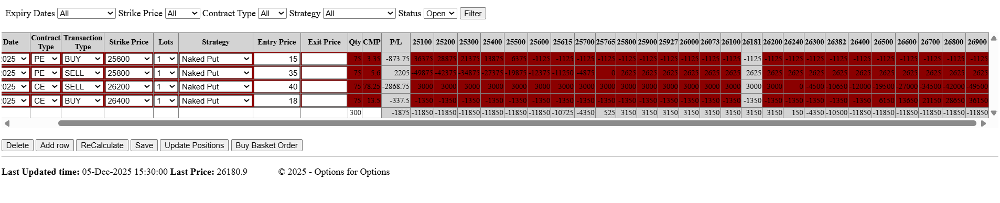

# Strategy Builder

## Overview

Multi-leg options strategy builder with P/L calculations, payoff chart visualization, and order execution capability.

## Screenshots



## Features

- **Multi-leg Strategies**: Add unlimited legs
- **Strategy Templates**: Iron Condor, Straddle, Strangle, Bull/Bear spreads
- **P/L Grid**: Dynamic spot price columns with color gradient
- **Breakeven Columns**: Breakeven points highlighted in grid
- **Live CMP**: Current Market Price via WebSocket
- **Exit P/L**: Real-time exit profit/loss per leg
- **Payoff Chart**: Visual profit/loss diagram
- **Summary Cards**: Max Profit, Max Loss, Breakeven, Risk/Reward
- **P/L Modes**: "At Expiry" (intrinsic) or "Current" (Black-Scholes)
- **Save/Load**: Persist strategies to database
- **Share**: Generate shareable links
- **Import Positions**: Load existing positions from broker
- **Buy Basket Order**: Execute multi-leg orders via Kite

## User Flow

1. Select underlying (NIFTY/BANKNIFTY/FINNIFTY)
2. Add legs using + button
3. Select expiry, strike, CE/PE, BUY/SELL, lots
4. Enter entry prices (or use CMP)
5. Click ReCalculate for P/L grid
6. Review payoff diagram and summary
7. Save strategy or execute orders

## Technical Implementation

### Backend

**API Endpoints:**

| Method | Endpoint | Description |
|--------|----------|-------------|
| GET | `/api/strategies` | List saved strategies |
| GET | `/api/strategies/{id}` | Get strategy details |
| POST | `/api/strategies` | Save new strategy |
| PUT | `/api/strategies/{id}` | Update strategy |
| DELETE | `/api/strategies/{id}` | Delete strategy |
| POST | `/api/strategies/calculate` | Calculate P/L grid |
| POST | `/api/strategies/{id}/share` | Generate share code |
| GET | `/api/strategies/shared/{code}` | Get shared strategy (public) |

**P/L Calculation (`app/services/pnl_calculator.py`):**
- At Expiry: Intrinsic value calculation
- Current: Black-Scholes pricing using scipy
- Returns: spot prices, P/L values, max profit/loss, breakevens

**Lot Sizes:**
- NIFTY: 75
- BANKNIFTY: 15
- FINNIFTY: 25

**Database Models:**
- `Strategy` - Strategy metadata (name, underlying, share_code)
- `StrategyLeg` - Individual legs (strike, expiry, type, lots, prices)

### Frontend

**Components:**
- `StrategyBuilderView.vue` - Main view
- `StrategyHeader.vue` - Underlying selector, P/L mode toggle
- `StrategyLegRow.vue` - Editable leg row
- `StrategyActions.vue` - Action buttons
- `SaveStrategyModal.vue` - Save dialog
- `ShareStrategyModal.vue` - Share link dialog
- `BasketOrderModal.vue` - Order confirmation

**Store:**
- `stores/strategy.js` - Strategy state management

## Testing

```bash
npm run test:strategy
npm run test:iron-condor  # Iron Condor specific tests
```

## Related

- [Option Chain](./option-chain.md) - Add legs from option chain
- [Positions](./positions.md) - View executed positions
- [Orders API](../api/README.md) - Basket order execution
